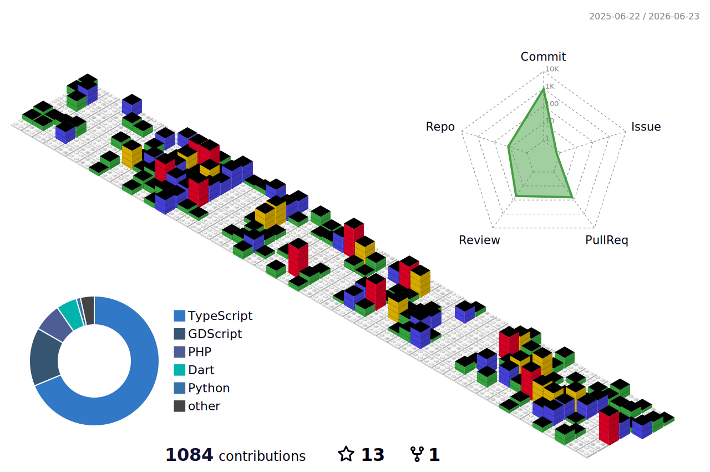
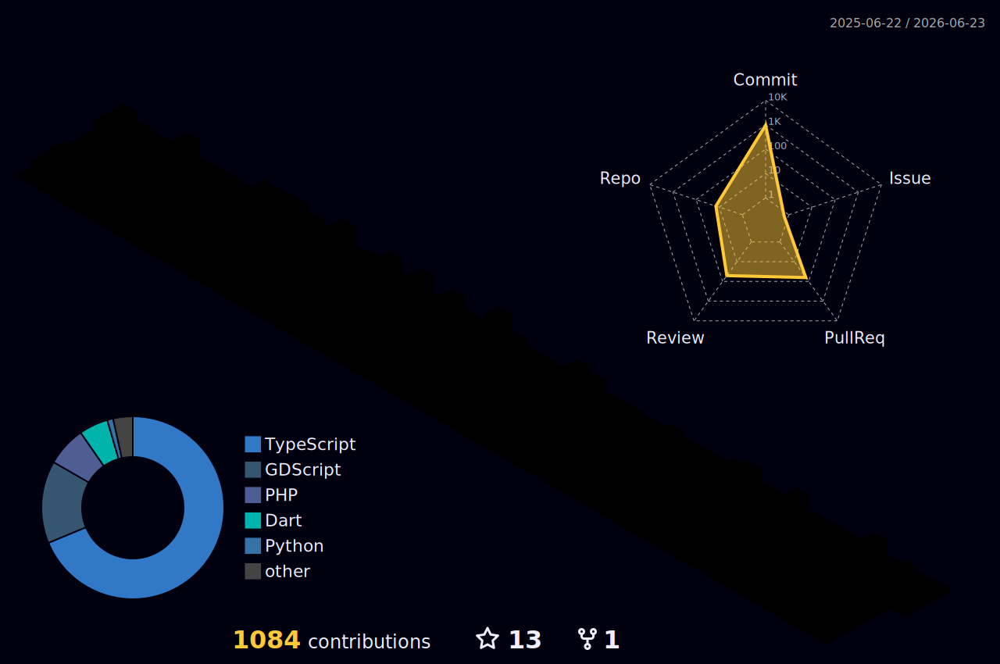
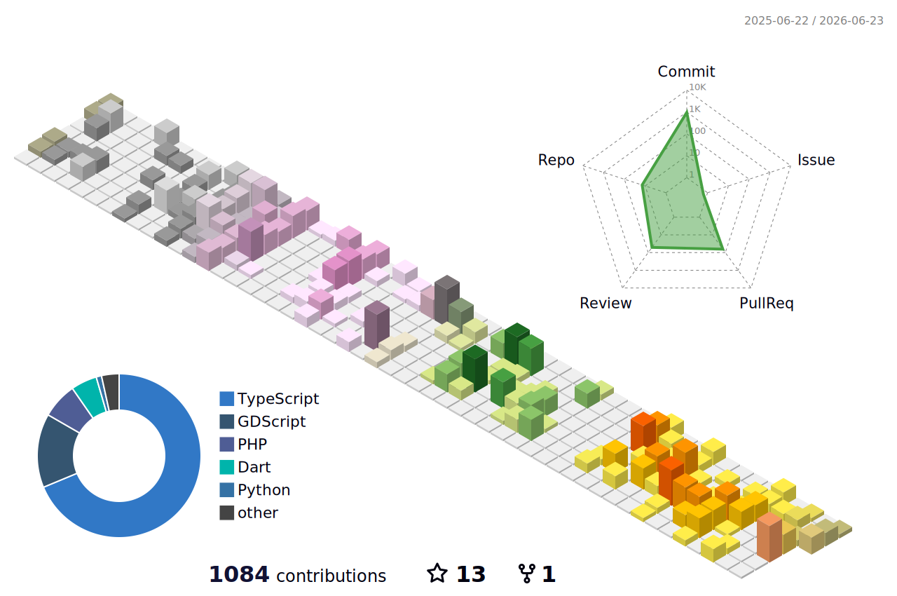

<!-- Diferentes Formatos de Cabeçalho (Capsule Render) -->
### 1. Waving (Ondas Animadas)

### 2. Cylinder (Cilindro 3D)

## Hi there 👋

<!-- Efeito de Digitação (Typing SVG) -->

### 🏙️ Meu GitHub City (3D Contrib)
*(Aqui aparecerá a sua cidade 3D assim que o Action rodar e analisar os seus commits!)*

<!--
**mygk-bea/mygk-bea** is a ✨ _special_ ✨ repository because its `README.md` (this file) appears on your GitHub profile.

Here are some ideas to get you started:

- 🔭 I’m currently working on ...
- 🌱 I’m currently learning ...
- 👯 I’m looking to collaborate on ...
- 🤔 I’m looking for help with ...
- 💬 Ask me about ...
- 📫 How to reach me: ...
- 😄 Pronouns: ...
- ⚡ Fun fact: ...
-->

---

<!-- Rodapé Animado (Capsule Render) -->

