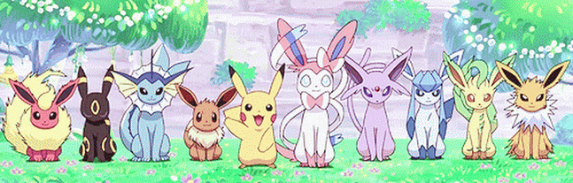
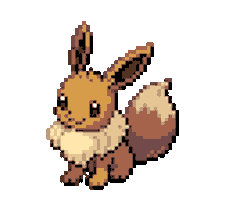

---
 

  
<i>"Meu nome é Bea, conheça mais sobre mim aqui! ⬇️"</i>

## Quem sou eu? 

<h2 align="center">Algumas Stacks e Skills</h2>

  
  
  
  
  
  
  
  
  
  
  
  
  
  
  
  
  
   
   
  • • •
   
   
  
  
  
  
  
  
  

<h2 align="center">Minhas Estatísticas</h2>

   
   

   

<!--
**mygk-bea/mygk-bea** is a ✨ _special_ ✨ repository because its `README.md` (this file) appears on your GitHub profile.

Here are some ideas to get you started:

- 🔭 I’m currently working on ...
- 🌱 I’m currently learning ...
- 👯 I’m looking to collaborate on ...
- 🤔 I’m looking for help with ...
- 💬 Ask me about ...
- 📫 How to reach me: ...
- 😄 Pronouns: ...
- ⚡ Fun fact: ...
-->